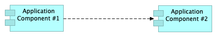
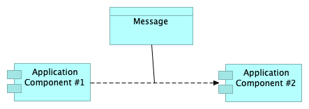

# archimate2rdf
Translating the ArchiMate Model Exchange File Format to RDF

The Open Group has published the ArchiMate Model Exchange File format - a standard file format for the exchange of ArchiMate models between different tools. Resources can be found at: https://www.opengroup.org/open-group-archimate-model-exchange-file-format

The aim for this project, archimate2rdf, is to create a translator that fully translates a ArchiMate exchange file to a corresponding OWL ontology.

Current status:
- It works :-)
- All standard and custom properties and relationships are translated, even relationships from or to relationships (Archimate 3.0)
- Only model elements and relationships are translated, diagrams are currently not supported;
- Target ontology is work-in-progress, some design decisions are not final, comments are welcomed!

We expect the ontology to change. Our current focus is the creation of a complete translator. This means that the current ontology is as close to the XSD as possible, focussing on simplicity. The ontology doesn't contain any "knowledge" about the ArchiMate language that is not available in the XSD (the ontology is actually generated from the XSD at this moment!). We expect that the final ontology will have a more semantic orientation.

Recent improvements:
- Creation of URI's that are dereferenceable
- Promotion of Linked Data properties in ArchiMate (that start with "http" or contain a ":") to true RDF properties
- Inclusion of namespaces of a number of popular vocabularies, allowing shorthand reference in ArchiMate properties or their values
- The option to generate a SKOS enriched version of the model
- Translation of model metadata to a SKOS ConceptScheme
- The option to refer to images, generated by Archi, in SKOS output
- Translation of views to SKOS concepts
- Generation of SKOS Collections for all ArchiMate concepts in ArchiMate ontology
- Inclusion of ArchiMate definitions in ArchiMate ontology.ttl    

## Usage

Build, or download [archimate2rdf.jar](https://github.com/bp4mc2/archimate2rdf/releases/download/v0.1.0/archimate2rdf.jar)

`java -jar archimate2rdf.jar <input.xml> <output.xml> [-skos] [domain=<domain>] [stylesheet=<stylesheet>] [images=<images>]`

>`-skos` generates SKOS Concepts in output target 

>`domain=<domain>` specifies base URI to use for resources

>`stylesheet=<stylesheet>` specifies XSLT stylesheet to use instead of default stylesheet

>`images=<images>` specifies base URL of images of views, as generated by Archi HTML publisher

## Ontology

The ontology we use can be found here: https://bp4mc2.org/def/archimate

Unfortunately, no official archimate ontology exists. Different initiatives have been undertaken (listed below - as far as we know), but all these initiatives have in fact only a transformation goal. And for that, you need a target ontology! Our own target ontology is nothing better: something we need to translate a particular archimate exchange file to. Interchange of RDF archimate files will only be possible if we all agree upon one, canonical, ArchiMate ontology.

**We urge the Open Group to publish the archimate ontology at their own namespace! We welcome them to use ours, or one of the other ontologies mentioned below. Please :-)**

### Other efforts

Some other people have tried to create an archimate ontology, or mention the need for one:

- https://www.linkedin.com/pulse/from-archimate-language-web-ontology-dr-nicolas-figay
- https://github.com/nfigay/archimate.owl
- https://github.com/archimatetool/OWLExchange
- https://forum.archimatetool.com/index.php?topic=309.0
- https://groups.google.com/forum/#!topic/open-archimate-forum/poUR2BRqve0
- https://github.com/ikm-group/ArchiMEO/blob/master/ARCHIMEO/ARCHIMATE/ArchiMate.ttl
- https://link.springer.com/chapter/10.1007/978-3-642-54734-8_7
- https://www.sba-research.org/wp-content/uploads/publications/ant_csimq14.pdf

## Mapping

We used the ArchiMate Model Exchange File format to create the transformation. The reason we used this file format is:

1. It's a standard - a clear meaning is understood;
2. It's tool independent - anybody can use our transformation software, regardless of the tool used;
3. It's an XML format, so transformation using XSL is quite straightforward and easily understood.

The actual transformation XSL can be found here: [src/main/java/resources/xsl/archimate2rdf.xsl](https://github.com/bp4mc2/archimate2rdf/blob/master/src/main/resources/xsl/archimate2rdf.xsl)

The following rules were followed for the transformation:

### Element to OWL Class
An ArchiMate Element is mapped to an OWL Class.

The xsi:type of the Element is used as the fragment part for the URI of the OWL Class, UpperCamelCase.

> `<element xsi:type="BusinessRole">` is mapped to `archimate:BusinessRole`

### Relationship to OWL ObjectProperty
An ArchiMate Relationship is mapped to an OWL ObjectProperty.

The xsi:type of the Relationship is used as the fragment part for the URI of the OWL ObjectProperty, lowerCamelCase.

> `<relationship xsi:type="Assignment">` is mapped to `archimate:assignment`

An alternative to the stricted naming might be to use the verbalisation, for example: "isAssignedTo". Because this would introduce a more complex mapping, we have not done that (yet).

### Access types as subproperties
The Access relationship is a relationship that is further subtyped using an accessType property. The most natural way of mapping this to an ontology, is to use subproperties.

> `<relationship xsi:type="Access" accessType="Read">` is mapped to `archimate:readAccess`

### Name to rdfs:label
The name of an element is mapped to rdfs:label. You could argue that a archimate-specific property would be more appropriate. From a interoperability perspective, we prefer all resources to have a rdfs:label.

### Documentation to rdfs:comment
The documentation of an element is mapped to rdfs:comment. You could argue that a archimate-specific property would be more appropriate. From a interoperability perspective, we prefer rdfs:comment.

### Reification of relationships using rdf:Statement
In some cases, an Archimate model will have relationships with their own properties:

- A relationship can have a name;
- A relationship can have documentation;
- It is possible to relate an element to a relationship (as of ArchiMate 3.0);
- It is possible to relate a relationship to an element (as of ArchiMate 3.0).

As is described above, relationships are modelled as OWL ObjectProperties. As such, it is not possible to add extra data to these relationships, because the triple itself doesn't have a URI. For example, the example below depicts how a ArchiMate relationship is mapped to RDF:



```
ex:AC1 a archimate:ApplicationComponent;
  rdfs:label "Application Component #1";
  archimate:flow ex:AC2;
.
ex:AC2 a archimate:ApplicationComponent;
  rdfs:label "Application Component #2"@en;
.
```

It is clearly visible, that even in the pre-3.0 versions of ArchiMate, this mapping is problematic with regard to the name or documentation of the relationship. An how would we map the following model:



The solution is the use of rdf:Statement. From this statement, the original triple could even be inferred. We prefer, however, to explicitly include the original triple for easy of use, for example in SPARQL queries:

```
ex:AC1 a archimate:ApplicationComponent;
  rdfs:label "Application Component #1"@en;
  archimate:flow ex:AC2;
.
ex:AC2 a archimate:ApplicationComponent;
  rdfs:label "Application Component #2"@en;
.
ex:DO1 a archimate:DataObject;
  rdfs:label "Message"@en;
.
ex:rel1 a rdf:Statement;
  rdf:subject ex:AC1;
  rdf:object ex:AC2;
  rdf:predicate archimate:flow;
  archimate:association ex:DO1;
.
```

### Identifier to URI
The example above used human-readable URIs for the example resources (`ex:AC1`, `ex:AC2`, `ex:DO1` and `ex:rel1`). The actual mapping uses the original identifier from the XML file. For every resource a URI is generated that conforms to the following format:

> `http://{context}/id/{type}/{identifier}`, for instance `http://bp4mc2.org/archimate/input/id/BusinessActor/id-93bf197b-5a00-4b44-856c-2638ae4e30fd`

where `{context}` consists of a domain (here: http://bp4mc2.org/archimate/) and the name of the ArchiMate model (here: input).

The domain to be used as part of the URI can be configured by providing an additional input parameter:
> `java -jar archimate2rdf.jar <input.xml> <output.xml> domain=http://example.org/`

This can be used to create [dereferenceable URIs](https://www.w3.org/TR/ld-glossary/#dereferenceable-uris).

If no such domain parameter is provided, the default domain `http://bp4mc2.org/archimate/` is used.

### Custom properties to new properties
Custom properties are mapped to new properties. This means that adding custom properties to the model will extend the ArchiMate ontology. The URI's for these properties are created from the identifier of the propertydefinition and the name of the model:

> `<property propertyDefinitionRef="propid-1">` is mapped to `<http://bp4mc2.org/archimate/my-model/property/propid-1> rdfs:subClassOf archimate:property.`
> (With "My model" being the name of this specific model)

From this, the actual use of such a property can be mapped to this newly created property:

> `<property propertyDefinitionRef="propid-1">`
> `  <value xml:lang="en">Active Structure</value>`
> `</property>`
> is mapped to
> `@prefix property: <http://bp4mc2.org/archimate/my-model/property/>.`
> `[] property:propid-1 "Active Structure."`
> (where `[]` should be replaced with the URI of the specific model element)

It could be argued that we shouldn't use the identifier of the property, but the more readable label of the property. Because this would add more complexity to the translator, we have not done that (yet).

### SKOS support
We have added support for SKOS in the transformation. This has impact on various parts of the transformation. We summarize the most important ones below.

> `<metadata>` and its properties are mapped to `skos:conceptScheme` with similar properties

> `<element>` is mapped to `skos:Concept`, its name to `skos:prefLabel`, its description to `skos:scopeNote`

> `<relationship>` is  mapped to `archimate:Relationship` (which is a new class)

> `<view>` is  mapped to `skos:Concept` 

> elements, views and relationships with properties are added to `skos:Collection` per type of concept


